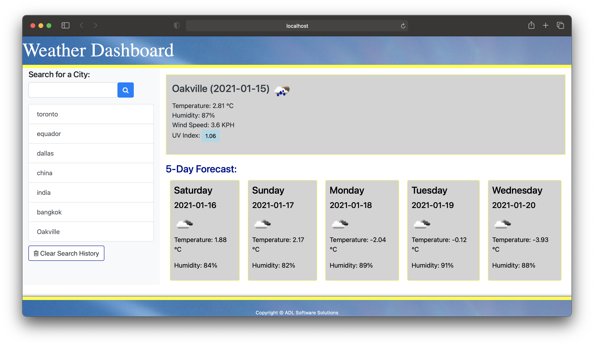

# Server Side / Weather API 
>  This application allows users to pull current day and 5 day weather forecasts. In your current forecast you'll see the humidity, current temperatures and UV Report that is colour coded based on severity. In the 5 Day forecasts, you'll see the date, temperature, weather icon for conditions and humidity. You can search by city, state or province. All searches will be saved until cleared.

## Table of contents
* [General info](#general-info)
* [Deployed link](#deployed-link)
* [Screenshots](#screenshot)
* [Technologies](#technologies)
* [Setup](#setup)
* [Features](#features)
* [Status](#status)
* [Contact](#contact)

## General info
Sixth weekly assignment due on Sunday January 17, 2021 @ 11:59 PM.

## Deployed link
https://alovatt83.github.io/online-schedule/

## Screenshot

## Technologies
* HTML
* CSS
* JavaScript
* JQuery
* Bootstrap
* Open API Call

## Setup
Clone files into your own root directory, file extensions are relative and will operate normally.

## Code Examples
Show examples of usage:

HTML:

  <meta charset="UTF-8">
  <meta name="viewport" content="width=device-width, initial-scale=1.0">
  <meta http-equiv="X-UA-Compatible" content="ie=edge">

  <!-- CSS -->
  <link rel="stylesheet" type="text/css" href="./assets/css/style.css">
  <!-- Bootstrap -->
  <link rel="stylesheet" href="https://stackpath.bootstrapcdn.com/bootstrap/4.3.1/css/bootstrap.min.css">
  <!-- Font Awesome -->
  <link rel="stylesheet" href="https://cdnjs.cloudflare.com/ajax/libs/font-awesome/4.7.0/css/font-awesome.min.css" />

  <title>Weather Dashboard</title>

</head>

<body>
  <!-- Header -->

  <header>Weather Dashboard
  </header>

  <!-- Container -->

  

    <!-- Row -->
    

      <!-- Column -->
      

        <h5 class="mt-1">Search for a City:</h5>
        <!-- Seach Form -->
        

          <!-- Input -->
          <input class="form-control" type="text" id="search-value" />
          <!-- Btn -->
          <button class="btn btn-primary" id="search-button"> <i class="fa fa-search"></i> </button>
        

        <!-- Search History List -->
        <ul class="list-group history"></ul>
        <ul class="clear"> <button class="btn btn-clear" id="clear-button"><i class="fa fa-trash-o" aria-hidden="true">
              Clear Search History</i></button></ul>
        

      <!-- Weather Info Column -->
      

        

 
        

        

        

      

    

  

  
  
CSS:

html,
body {
	display: flex;
	height: 100%;
	flex-direction: column;
    margin: 0;
    background-color: lightblue;
    font-family: Tahoma;
}

.row {
	margin-bottom: 30px;
}
header {
	border-bottom: 8px solid darkgrey;
    background-image: url(header.jpg);
    font-size: 60px;
    text-align: left;
    color: white;
    font-weight: 900;
    text-shadow: 2px 2px #050505;
}

#forecast-container {
	border: 5px solid yellow;
	padding: 15px;
    line-height: 30x;
    background-color: lightgrey;
}

#name-div {
	font-size: 25px;
	font-weight: 500;
	padding-right: 5px;
	float: left;
    color: #343a40;
 
}

#five-title {
	font-size: 25px;
	font-weight: 500;
    color: darkblue;
    
}

h5 .mt-1 {
	color: yellow;
}

h1 {
	text-align: center;
	padding: 15px 20px 20px 15px;
    color: white;
    background-color: lightgrey;
}

JavaScript:

  $(document).ready(function () {

	// Search Value & Click Button From FontAwesome
	$("#search-button").on("click", function () {
    event.preventDefault();
    var searchValue = $("#search-value").val();
    $("#search-value").val("");
    // Clear Boxes After Submission
	$("input:text").click(function () {
		$(this).val("");
		$("#today").empty();
        $("#forecast").empty();
	});
	searchWeather(searchValue);

});

	

	// Searcn History
	$(".history").on("click", "li", function () {
		searchWeather($(this).text());

	});

	// Search History LI Creation
	function makeRow(text) {
	
    var li = $("<li>")
			.addClass("list-group-item list-group-item-action")
			.text(text);
		$(".history").append(li);
	}

	// Set Measurement Units & Add 
	var metricUnits = "&units=metric";

	var openWeatherMap = "&appid=ac762fe30e04abc584e95fe72ccef3d8";

    
    function searchWeather(searchValue) {
	// Activate 'GET' Function with Outside API
	$.ajax({
		type: "GET",
		url:
			"https://api.openweathermap.org/data/2.5/weather?q=" +
			searchValue +
			metricUnits +
			openWeatherMap,
		dataType: "json",
		success: function (data) {
		
	// Save Previous Searches In Local Storage
		if (history.indexOf(searchValue) === -1) {
			history.push(searchValue);
			window.localStorage.setItem("history", JSON.stringify(history));
			
			makeRow(searchValue);
		}
		$("#today").empty();
		$("#forecast").empty();

	// Time & Date Conversions

	var sec = data.dt;
	var forecastdate = new Date(sec * 1000);
	var timestr = forecastdate.toLocaleTimeString();
	var datestr = forecastdate.toLocaleDateString();
	var daystr = forecastdate.getUTCDay();
	var weekday = new Array(7);
		weekday[0] = "Sunday";
		weekday[1] = "Monday";
		weekday[2] = "Tuesday";
		weekday[3] = "Wednesday";
		weekday[4] = "Thursday";
		weekday[5] = "Friday";
		weekday[6] = "Saturday";
    
  
## Features
List of features
* Open API Renders Information Form Established Appl;ication.
* Search any city or province / state.
* Save your previous searches.
* See current weather conditions.
* See 5 dat forecast.

To-do list:
* Project completed

## Status
Project is: completed. Assignment ready for submission.

## Contact
Created by Allen Lovatt - allenlovatt@gmail.com
